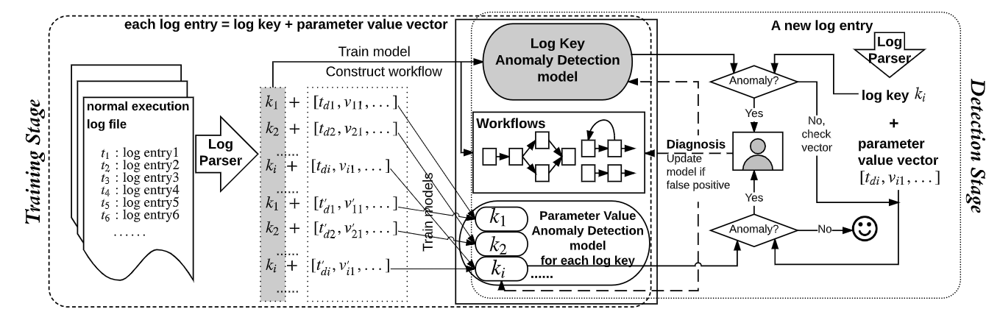

### 参考场景

#### 1.  新闻推荐

新闻推荐场景中，输入为每个用户的历史点击新闻，用户的个人信息，以及用户可能要预览的候选新闻集合。模型通过用户的个人信息和历史点击新闻信息对用户建模，通过新闻的类型、标题、内容等具体信息对新闻建模。最终获得某用户对所有候选新闻的点击得分，来预测用户接下来最有可能点击的新闻。

#### 2. 日志检测

系统日志文件一般都是半结构化数据，通常包括时间戳、错误信息、IP地址、目标组件等。可以用于异常检测和故障定位。我们的配置数据和日志数据类似，在数据处理方面可以参考。

Log Parsing：解析原始日志，一般包括固定值，变量（IP、名称、id等）。

异常检测模型：根据时序日志预测下一个日志事件，并与实际情况对比，判断是否异常。

##### Related Works

*paper 1*：[**Self-Attentive Classification-Based Anomaly Detection in Unstructured Logs**](https://ieeexplore.ieee.org/abstract/document/9338283/)

处理方法类似于我们的方法一，==删除变量词，只保留语句==，并使用NLTK分词，建立词典并转化为向量。

*paper 2*：**Robust Log-Based Anomaly Detection on Unstable Log Data**

==处理日志文本时，同样不考虑参数变量==，并将每条剩下的语义词作为整体，考虑上下文语义。使用预训练词向量（FastText在Common Crawl Corpus数据集上训练）

*paper 3*：**SwissLog: Robust and Unified Deep Learning Based Log Anomaly Detection for Diverse Faults**

==同样不考虑参数值。根据已知有效词典识别词==

提到的一种数据格式，类似于配置数据，使用于该模型中：

*paper 4*：**[DeepLog | Proceedings of the 2017 ACM SIGSAC Conference on Computer and Communications Security](https://dl.acm.org/doi/abs/10.1145/3133956.3134015)**

每个日志事件解析为两部分：log key、参数值，==考虑到参数，但是没有代入模型==。

将日志条目视为遵循某些模式和语法规则的序列元素，日志建模为自然语言序列。

eg1：“Took 10 seconds to build instance”，其中，Took * seconds to build instance 为log key，参数值10单独抽取出来。

参数不加入模型的训练，而是作为预测之后的校验。

