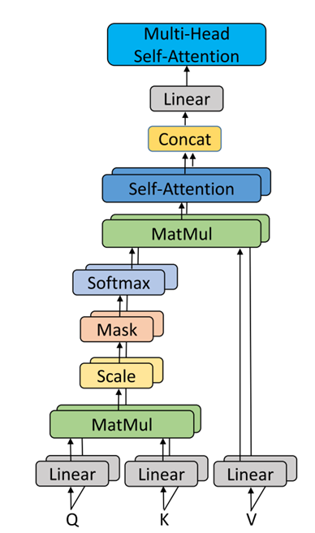
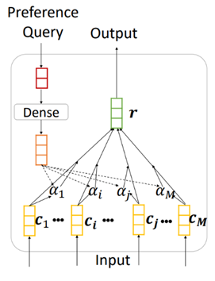
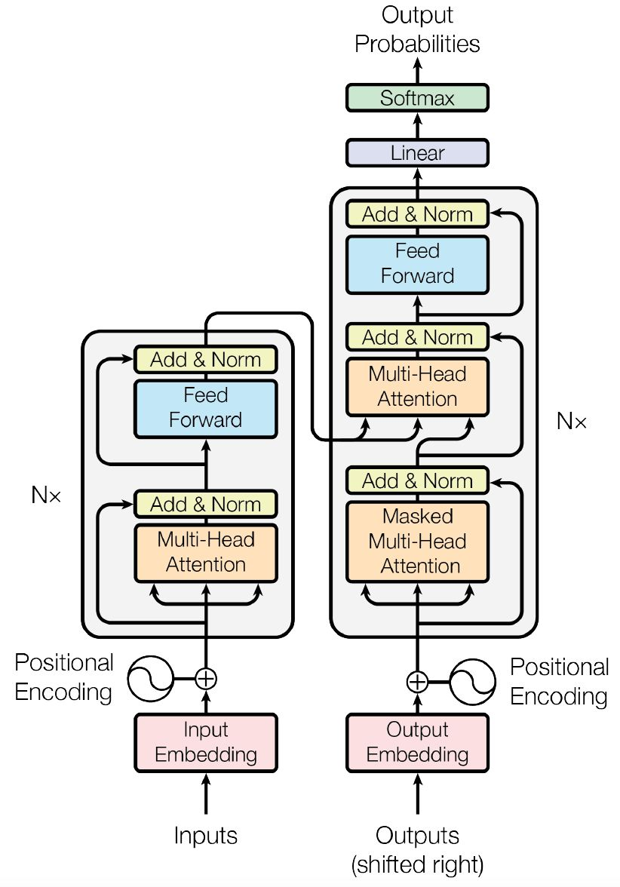
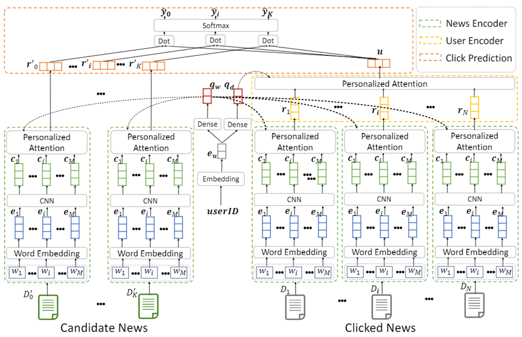

## 1. 当前模型

### 1.1 模型v2

新版本的模型参考transformer框架中的部分思想设计，模型同样包含三个模块：*Config Encoder，VM Encoder，Prediction Model*，具体模型框架如下图：

**「Input」**

对每一组数据（每个VM），有：

1. 当前请求的配置Request Config

2. 该VM在数据库中即将要下发的候选配置集合Candidate Config

3. 该VM的id

4. 该VM的相似VM的历史下发配置序列History Config Sequence

   

**「Config Encoder」**

1. **Embedding**：词嵌入，将每个输入的配置的每个词映射为一个固定维度稠密向量。

   本模型中，如果所有配置相同，将(feature_size,  word_size)维度的配置转化为(feature_size,  embedding_size)。

   如果配置类型不同，将输入配置作为文本处理，所有类型的配置设定统一长度的词，即将维度 (word_num, word_size)通过Embedding层处理为(word_num, embedding_size)。

2. **Multi-head Self-Attention：**

   不同的随机初始化映射矩阵$W_q, W_k, W_v$可以将输入向量映射到不同的子空间，这可以让模型从不同角度理解输入的序列。因此同时几个Attention的组合效果可能会优于单个Attention，这种同时计算多个Attention的方法就是Multi-Head Attention，或者多头注意力。Multi-head Attention的结构如下图：

   

**Add&Norm：**作用同上

**「VM Encoder」**

1. **Personalized Attention：**结构作用同模型v1。

2. **Add&Norm：**残差模块和归一化，可以有效的改善深层模型中梯度消失的问题，加速收敛，以帮助深层网络更好的训练。参考Transformer里的Add&Norm结构。

**「Prediction Model」**

1. **FFN：**包括两个线性层和激活函数

**「Output」**

对于每个VM的所有候选配置，都有一个范围(0,1)的预测分。根据预测分来确定预先下发哪些配置。

#### 1.2 模型更新

模型的三个模块保持不变，具体的组成细节可以根据训练结果调整。

### 2. 参考模型

#### 2.1 Transformer[^1]

参考Transformer模型中的Multihead Attention、Add & Norm和Feed Forward部分。

#### 2.2 NPA[^2]

参考NPA中Personalized Attention 、Click Prediction部分。

#### 2.3 BERT[^3]

#### 2.4 Attention

## Ref

[^1]: [Attention is All you Need (neurips.cc)](https://proceedings.neurips.cc/paper/2017/hash/3f5ee243547dee91fbd053c1c4a845aa-Abstract.html)
[^2]: [NPA | Proceedings of the 25th ACM SIGKDD International Conference on Knowledge Discovery & Data Mining](https://dl.acm.org/doi/abs/10.1145/3292500.3330665)

[^3]:[1810.04805\] BERT: Pre-training of Deep Bidirectional Transformers for Language Understanding (arxiv.org)](https://arxiv.org/abs/1810.04805)
