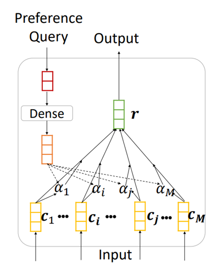

## 一、背景介绍


海量的网络配置请求需要通过控制平面下发到各南向计算节点。为了解决大规模云计算平台架构中控制平面为不同租户的VPC下发配置消息的问题，需要为控制平面Alcor设计并实现高并发、低时延、可拓展、低冗余的消息分发服务。

Alcor的消息服务主要分为两个部分：（1）Available Zone（AZ）/Region级别的数据平面管理器（DataPlaneManager，DPM）负责计算正确网络配置并实现大规模消息下发通道；（2）Cluster级别的NetworkConfigrationManager（NCM）负责网络配置的按需下发。其中DPM已完成主体设计但还有较大的改进空间。我们开发的消息服务模块在MQ中为每个VPC创建一个topic，在大规模云平台下topic数过多，且可能存在许多小的vpc，导致资源浪费。因此需要在NCM中设计网络配置按需下发的算法，从而减少消息传输的冗余度。

在处理来自控制面的网络配置时，NetworkConfigManager (NCM) 服务会立即下放必须的配置（Port、Gateway等），同时保留非必须的配置（NeighborInfo、SecurityGroup等）。当数据面需要对应配置时，向NCM请求下发所需配置。所以需要对留存配置设计按需下发逻辑和算法。

目前采用的方法是，在处理来自控制面的网络配置时，由DataPlaneManager通过MQ\gRPC将全量网络配置下发给数据面。然而当VPC中节点数量巨大的时候，一次性下放巨量配置可能会影响整个系统的性能 。当节点数量巨大的时候，过于频繁的请求会造成NCM服务负载过大及IO拥塞。同时，请求造成的时延也会降低系统性能。

为了解决上述问题， 需要设计NetworkConfigManager (NCM) 服务来分析节点当前真正需要的配置，设计配置处理逻辑，对已到达的消息进行语义合并，对不需要立即下发的网络配置进行批量延迟下发、分次下发，实现数据面网络配置的按需下发，。从而平滑系统负载曲线，降低通道峰值压力，优化网络配置下发延迟。


## 二、网络配置分析

在配置库里留存的的两种配置Neighbor、Security Group。静态配置属性数据可以作为模型输入特征。

### 2.1 Neighbor 

```protobuf
enum NeighborType { 
    L2 = 0; // the default type
    L3 = 1;
}

message NeighborConfiguration {
    uint32 revision_number = 1;

    string request_id = 2;
    string id = 3;
    UpdateType update_type = 4; // DELTA (default) or FULL
    string vpc_id = 5;
    string name = 6;
    string mac_address = 7;
    string host_ip_address = 8;

    message FixedIp {
        NeighborType neighbor_type = 1;
        string subnet_id = 2;
        string ip_address = 3;
    }

    message AllowAddressPair {
        string ip_address = 1;
        string mac_address = 2;
    }

    repeated FixedIp fixed_ips = 9;
    repeated AllowAddressPair allow_address_pairs = 10;
}

message NeighborState {
    OperationType operation_type = 1;
    NeighborConfiguration configuration = 2;
}
```


### 2.2 Security Group

```protobuf
message SecurityGroupConfiguration {
    uint32 revision_number = 1;

    string request_id = 2;
    string id = 3;
    UpdateType update_type = 4; // DELTA (default) or FULL
    string vpc_id = 5;
    string name = 6;

    enum Direction {
        EGRESS = 0;
        INGRESS = 1;
    }

    message SecurityGroupRule {
        OperationType operation_type = 1;
        string security_group_id = 2;
        string id = 3;
        Direction direction = 4;
        EtherType ethertype = 5;
        Protocol protocol = 6;
        uint32 port_range_min = 7;
        uint32 port_range_max = 8;
        string remote_ip_prefix = 9;
        string remote_group_id = 10;
    }

    repeated SecurityGroupRule security_group_rules = 7;
}

message SecurityGroupState {
    OperationType operation_type = 1;
    SecurityGroupConfiguration configuration = 2;
}
```


### 2.3 配置属性的数据类型

配置的一些基本属性，如Id、type、name等可以作为模型的输入特征，而其他作用不太的描述性属性可以舍弃。配置的属性大都是string以及int类型。

***createVPC.json***

```json
{
  "network": {
    "admin_state_up": true,
    "revision_number": 0,
    "cidr": "10.0.0.0/16",
    "default": true,
    "description": "vpc",
    "dns_domain": "domain",
    "id": "9192a4d4-ffff-4ece-b3f0-8d36e3d88038",
    "is_default": true,
    "mtu": 1400,
    "name": "sample_vpc",
    "port_security_enabled": true,
    "project_id": "3dda2801-d675-4688-a63f-dcda8d327f50"
  }
}
```


***createSecurityGroup.json***

```json
{
  "security_group": {
    "create_at": "string",
    "description": "string",
    "id": "3dda2801-d675-4688-a63f-dcda8d111111",
    "name": "sg1",
    "project_id": "3dda2801-d675-4688-a63f-dcda8d327f50",
    "security_group_rules": [
    ],
    "tenant_id": "3dda2801-d675-4688-a63f-dcda8d327f50",
    "update_at": "string"
  }
}
```


## 三、相关调研


调研了机器学习在网络方面应用的论文，以及推荐系统用到的一些深度模型，在设计模型时主要参考以下两篇论文。


### 3.1 NPA[^1]

#### 论文介绍

*NPA：Neural News Recommendation with Personalized Attention*，这篇论文解决的问题是新闻推荐，根据用户的兴趣点推荐其最可能点击到的新闻。主要使用用户的历史浏览新闻序列来提取用户的兴趣点，从候选新闻中找出用户接下来可能点击到的新闻。主要包含以下两个模型。

News representation model：使用CNN来学习新闻标题的上下文表示。Attention机制用来表示不同词对不同新闻的重要程度。

User representation model：根据用户的历史新闻点击来学习用户的表示。Attention机制用来表示不同新闻对不同用户的重要程度。

Personalized Attention：相同的词和新闻对于不同用户的信息量可能不同，通过使用用户 ID 的嵌入作为词和新闻级注意力网络的查询向量来区分根据用户的喜好关注重要的词语和新闻。


#### 模型介绍

模型的具体结构如下图，主要包含三个部分：

**「News Encoder」**：根据新闻标题学习新闻表示，包括三个模块

- Word Embedding：新闻标题中每个词表示为一个低维vector
- CNN：捕捉新闻的上下文信息
- Personalized Attention：词级Attention，不同词对同一新闻的表示权重不同。而对于不同用户，同一词也有不同表示信息量，使用user_id 作为Attention中的query

**「User Encoder」**：根据用户历史点击新闻学习用户表示

- Personalized Attention：新闻级Attention

**「Click Prediction」**：预测一系列候选新闻的点击分数


### 3.2 SeqFM[^2]

#### 论文介绍

这篇论文解决的问题是推荐系统，根据用户过去的购买顺序预测下一个可能购买的商品。用户历史购买商品的顺序对预测结果有影响，下一个可能购买商品可能和近期内购买商品相关度更高，而不是远期。

为了实现时序感知的预测模型，采用FFM以及Attention机制。模型的逻辑如下图，特征会分为静态特征和动态特征，动态特征具有时序特征。


#### 模型介绍

模型的具体细节如下图，主要模块有：

**「Embedding layer」**：每个特征使用one-hot表示，通过全连接层降维为密集vector。

 FFM：特征分为静态特征（用户信息、候选商品信息）和动态特征（历史购买顺序等具有时序特征的数据，按照时序构建），cross view增加特征之间的交互。

**「Self-Attention」**：表示特征之间的顺序和语义关系。

SeqFM在处理具有顺序属性的特征时，使用Masked self-attention，每个动态特征仅与当前时间之前的特征交互。

​             

## 四、基于机器学习的网络配置按需下发算法              


### 4.1 算法设计

为了预测VM需要的配置并提前下发，可以根据该VM的历史下发配置来学习下发逻辑，由于VM历史配置信息量不足，所以采用相似VM的配置下发序列来表示，相似VM的下发配置也具有一定的相关性。通过VM的表示vector与候选配置的交互来预测每个候选配置的下发可能性。参考新闻推荐模型NPA，模型中在学习配置表示和VM表示的时候使用到Personalized Attention结构。


### 4.2 语义表示**（Embedding）**

语义表示指的是将数值、文本等类型的数据转化为模型可以处理的向量，输入到模型中。静态配置数据的属性大都是string以及int类型，而一些string类型属性通常为无意义的字符序列，与实际句子不同。本模型使用到的embedding方式有以下几种：

 #### one-hot编码 

机器学习应用中，特征可能不是连续值，而是一些分类值。

例如，地区：[“Europe”,”US”,“Asia” ]，共三种值，普通编码使用00，01，10表示，而one-hot编码使用三位表示，分别为[1, 0, 0]，[0, 1, 0]，[0, 0, 1]，

One-hot编码比较稀疏，信息量少，适用于特征取值较少的情况。One-hot编码之后的向量需要降维为低维密集向量。

 

#### Word2vec

处理文本数据，转化为向量。

1. 对于有具体含义的文本，先分词，所有词构成词典。

   例如：'I am a boy.', 'How are you?', 'I am very lucky.'三个句子，取所有词构成word2id词典，可以按照出现频率排序，dict={i':0, 'am':1, 'a':2, 'boy':3, 'very':4, 'lucky':5, '.':6, 'how':7, 'are':8, 'you':9, '?':10}。三个句子分别表示为[0, 1, 2, 3, 6]，[7, 8, 9, 10, 0]，[0, 1, 4, 5, 6]。所有句子长度固定，不足补0。

2. 对于全是字符的特征值，一般为数字和字母组成，和一般文本不同，不具有具体含义。在将文本转化为向量时，无法分词，所以如“KLSDJsd323KENlmc”的特征值，每个字符作为一个词，同样建立word2id词典，处理方法同上。


## 五、模型设计


### 5.1 模型v1

模型的具体结构如下图，主要包含三个模块：*Config Encoder、VM Encoder和Config Prediction*。


**「Input」**

VM的候选配置库中的配置Candidate Config

当前请求配置Request Config

相似VM的历史下发配置History Config Sequence。


**「Personalized Attention」**Attention 结构如下，输入为多个特征，key和value通过特征本身获得，query使用其他数据，经过压缩后输入模型，输出为一个向量，用来表示VM或配置。分为特征级Attention和配置级Attention。  


**「Config Encoder」**根据配置的属性学习配置的表示。分为两个模块：Embedding和Personalized Attention。输入为每个配置的多个特征，输出为每个配置的向量表示。

*Embedding*：每个特征使用one-hot表示，维度大且稀疏，使用全连接层降维为密集vector。

*特征级Personalized Attention*：同特征对同一配置表示的影响也不同，同一配置对不同VM表示的影响不同。Attention中的key以及value源于自身，而query使用VM的基本信息表示，可以使用VM_id，或者该VM当前请求的配置。Config Encoder中的Personalized Attention层的输入为embedding之后的向量，输出为一个向量表示该配置。


 **「VM Encoder」**根据相似VM的历史下发配置学习VM的表示。使用Personalized Attention模型。输入为相似VM的历史下发配置的向量表示，输出为VM的向量表示。

*配置级Personalized Attention*：不同配置对同一用户的影响不同，同样，Attention中的key和value源于自身，query使用VM的基本属性特征来表示。VM Encoder中的Personalized Attention层的输入为相似VM的历史下发配置序列的向量表示，输出为该VM的向量表示。


**「Config Prediction」**计算每个候选配置表示向量和VM Encoder向量内积，通过softmax激活函数归一化后，输出该候选配置的预测分数。每个候选配置有一个0到1之间的预测值，预测值越高，说明该候选配置是VM即将下发的配置的可能性更高。训练模型时，候选配置中有一部分为需要下发的，另一部分为不需要下发的。通过设定阈值来判断哪些配置需要下发。


####  具体例子

**输入**：

预测目标VM1，已知VM1的相似VM2

相似VM2的历史配置下发序列：$H_1, H_2, H_3, H_4, H_5$                               

VM1的已下发序列： $C_1$

请求配置：$C_2$ 

候选配置： $C_3, C_4, C_5, C_6$


**输出**：每个候选配置的预测值  $y_{C_3}, y_{C_4}, y_{C_5}, y_{C_6}$

设定阈值k=2，则选择score最高的两个配置作为即将下发的配置。


### 5.2 ==模型v2==

新版本的模型参考transformer框架中的部分思想设计，模型同样包含三个模块：*Config Encoder，VM Encoder，Prediction Model*，具体模型框架如下图：


**「Input」**

对每一组数据（每个VM），有：

1. 当前请求的配置Request Config

2. 该VM在数据库中即将要下发的候选配置集合Candidate Config

3. 该VM的id

4. 该VM的相似VM的历史下发配置序列History Config Sequence

   

**「Config Encoder」**

1. **Embedding**：词嵌入，将每个输入的配置的每个词映射为一个固定维度稠密向量。

   本模型中，如果所有配置相同，将(feature_size,  word_size)维度的配置转化为(feature_size,  embedding_size)。

   如果配置类型不同，将输入配置作为文本处理，所有类型的配置设定统一长度的词，即将维度 (word_num, word_size)通过Embedding层处理为(word_num, embedding_size)。

2. **Multi-head Self-Attention：**

   不同的随机初始化映射矩阵$W_q, W_k, W_v$可以将输入向量映射到不同的子空间，这可以让模型从不同角度理解输入的序列。因此同时几个Attention的组合效果可能会优于单个Attention，这种同时计算多个Attention的方法就是Multi-Head Attention，或者多头注意力。Multi-head Attention的结构如下图：
   


**Add&Norm：**作用同上


**「VM Encoder」**

1. **Personalized Attention：**结构作用同模型v1。



2. **Add&Norm：**残差模块和归一化，可以有效的改善深层模型中梯度消失的问题，加速收敛，以帮助深层网络更好的训练。参考Transformer里的Add&Norm结构。


**「Prediction Model」**

1. **FFN：**包括两个线性层和激活函数


**「Output」**

对于每个VM的所有候选配置，都有一个范围(0,1)的预测分。根据预测分来确定预先下发哪些配置。


## 六、数据分析

### 6.1 Google集群数据

使用google的Borg集群数据，取InstanceEvents table中的数据。根据时间戳来确定每组数据的时序，作为下发顺序。将同一组数据作为候选数据。

| feature     | Function                 |
| ----------- | ------------------------ |
| timestamp   | 根据时间来确定配置的顺序 |
| machine id  | 输入特征1                |
| type        | 输入特征2                |
| platform id | 输入特征3                |


### 6.2 Alcor配置数据

所有的网络配置都可以用特征组合的形式来表示，Interger数据直接用数字表示（IP、Port、type、Id等），string类型数据可以分词、建立字典并用向量表示（MAC、info等）。如下图，一行数字表示一个配置特征。多个特征表示一个配置。


对于模型中具有不同配置，而不同配置的特征属性也不同的情况，我们将所有配置的内容作为文本，使用NLP中的文本处理方法。


### 6.3 ==大规模测试数据==

以subnet配置数据为例

```json
"{\"subnets\":[{\"id\":\"8182a4d4-ffff-4ece-b3f0-8d36e3d88001\",\"project_id\":\"3dda2801-d675-4688-a63f-dcda8d327f50\",\"tenant_id\":\"3dda2801-d675-4688-a63f-dcda8d327f50\",\"name\":\"subnet1\",\"description\":\"\",\"network_id\":\"9192a4d4-ffff-4ece-b3f0-8d36e3d88001\",\"cidr\":\"172.16.0.0/16\",\"availability_zone\":\"\",\"gateway_ip\":\"172.16.0.1\",\"gatewayPortId\":\"0fa8e166-af9e-47cc-9824-fb5cf000ca48\",\"gateway_port_detail\":{\"gateway_macAddress\":\"aa:bb:cc:d2:8a:5c\",\"gateway_port_id\":\"0fa8e166-af9e-47cc-9824-fb5cf000ca48\"},\"attached_router_id\":\"\",\"port_detail\":{},\"enable_dhcp\":true,\"primary_dns\":\"\",\"secondary_dns\":\"\",\"dns_list\":[],\"ip_version\":4,\"ipV4_rangeId\":\"8234e0a7-7dfe-4e73-89ac-1d964eef2da1\",\"ipV6_rangeId\":\"\",\"ipv6_address_mode\":\"\",\"ipv6_ra_mode\":\"\",\"revision_number\":1,\"segment_id\":\"\",\"shared\":\"\",\"sort_dir\":\"\",\"sort_key\":\"\",\"subnetpool_id\":\"\",\"dns_publish_fixed_ip\":false,\"tags\":[],\"tags-any\":\"\",\"not-tags\":\"\",\"not-tags-any\":\"\",\"fields\":\"\",\"dns_nameservers\":[],\"allocation_pools\":[{\"start\":\"172.16.0.1\",\"end\":\"172.16.255.254\"}],\"host_routes\":[{\"destination\":\"172.16.1.0/24\",\"nexthop\":\"172.16.1.1\"}],\"prefixlen\":\"\",\"use_default_subnet_pool\":false,\"service_types\":[],\"created_at\":\"2022-06-15 11:28:46\",\"updated_at\":\"2022-06-15 11:28:46\"}]}" 
```

subnet配置数据共42个属性，包括时间。

```python
id    8182a4d4-ffff-4ece-b3f0-8d36e3d88001
project_id    3dda2801-d675-4688-a63f-dcda8d327f50
tenant_id    3dda2801-d675-4688-a63f-dcda8d327f50
name    subnet1
description    
network_id    9192a4d4-ffff-4ece-b3f0-8d36e3d88001
cidr    172.16.0.0/16
availability_zone    
gateway_ip    172.16.0.1
gatewayPortId    0fa8e166-af9e-47cc-9824-fb5cf000ca48
gateway_port_detail    {'gateway_macAddress': 'aa:bb:cc:d2:8a:5c', 'gateway_port_id': '0fa8e166-af9e-47cc-9824-fb5cf000ca48'}
attached_router_id    
port_detail    {}
enable_dhcp    True
primary_dns    
secondary_dns    
dns_list    []
ip_version    4
ipV4_rangeId    8234e0a7-7dfe-4e73-89ac-1d964eef2da1
ipV6_rangeId    
ipv6_address_mode    
ipv6_ra_mode    
revision_number    1
segment_id    
shared    
sort_dir    
sort_key    
subnetpool_id    
dns_publish_fixed_ip    False
tags    []
tags-any    
not-tags    
not-tags-any    
fields    
dns_nameservers    []
allocation_pools    [{'start': '172.16.0.1', 'end': '172.16.255.254'}]
host_routes    [{'destination': '172.16.1.0/24', 'nexthop': '172.16.1.1'}]
prefixlen    
use_default_subnet_pool    False
service_types    []
created_at    2022-06-15 11:28:46
updated_at    2022-06-15 11:28:46
```


## 七、模型实现和测试

#### 7.1 Google数据测试

-  模型部分已使用Pytorch实现
-  已用google部分数据集训练和测试模型，测试集的准确率在60%左右
-  测试集结果分析：准确率不高的原因可能有：
  -  模型不适用该数据集
  - 该数据集可用性不高，数据特征与结果的关联不大，无法预测
  - 数据量小


#### 7.2 ==大规模测试配置数据测试==


## 八、参考文献

[^1]:NPA
[^2]:SeqFM
[^3]:Attention


